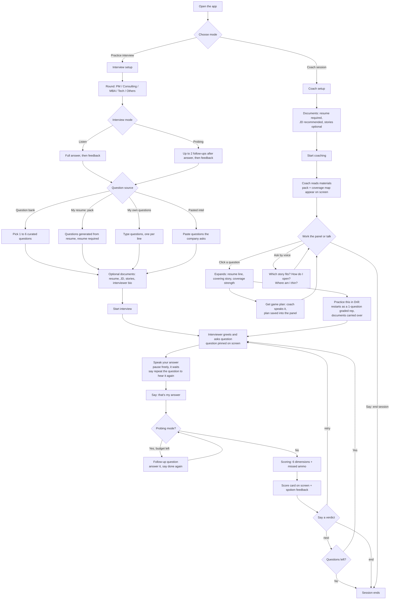

# User workflows

Every path a user can take through the product as of 2026-07-12. The web app is the primary surface; the console paths remain for development and offline use.

## The full map

## Interview workflows in words

**1. Quick rep, zero setup.** Practice interview, defaults untouched (PM, listen, 2 bank questions), no documents. Fastest path to speaking practice. Feedback still scores all 6 dimensions; missed ammo stays empty without documents.

**2. The full-feedback rep.** Same as above plus resume, JD, and stories uploaded (.pdf, .md, .txt, or paste). The score card gains the missed ammo section: verbatim facts from your documents your answer left out. The live interviewer never sees your documents; only the grader does.

**3. Resume-tailored session (pack).** Question source: my resume. Questions are generated from your actual resume lines against the JD. Every question is verifiably grounded: a question is dropped unless its resume line appears verbatim in your resume.

**4. Known-questions session.** Source: my own questions (paste a list) or pasted intel (paste a forum thread or recruiter notes; questions get extracted). For rehearsing a specific loop.

**5. Probing rep.** Interview mode: probing. After you finish, the interviewer asks up to 2 follow-ups picked by the analyzers (ownership, quantification, depth, specificity, emotional per round), each answered at your own pace. Then one combined scoring pass. Length is graded on the main answer only.

**6. Persona rep.** Paste an interviewer bio (their LinkedIn About text). Firm type and seniority are extracted, with every tag citing a verbatim bio phrase, and they shape probe mix, intensity, pacing, and the interviewer voice. Combine with any of the above.

**7. The retry loop.** After any score card: say "retry" to re-answer the same question immediately, "next" to move on, "end" to stop. Hearing "I versus We was a Gap" and re-answering right away is the fastest learning loop in the product.

**7b. The rewrite.** On any score card, press "Show me the rewrite". The coach produces dimension-tagged notes (your words, then the fix) plus a full rewritten answer built from your transcript and documents, on screen; the biggest fix is spoken. Read it, say "retry", and deliver the better version while it is fresh.

## Coach workflows in words

**8. Prep-map session.** Coach mode with resume + JD. The pack (8 to 12 likely questions, each tied to a resume line) and the coverage map (STRONG / PARTIAL / GAP per question, needs a stories doc) render in the side panel. The coach speaks a standing summary: how many questions, how many gaps.

**9. Game-plan drilling.** Click any question in the panel, press Get game plan. The coach speaks the plan (which story, the opening line, the one number to include) and writes it into the panel. Work through the pack question by question; by session end the panel is a filled-in prep sheet.

**10. Free voice consult.** Just talk: "which story fits the conflict question", "how should I open question three", "where am I thin against this JD". Answers come from your documents; the coach says so when your documents cannot answer. The coach never quizzes you.

**11. Gap-to-rep loop (the product in one motion).** Coverage map shows a GAP, click the question, get the game plan, press Practice this in Drill. The session restarts as a one-question graded rep with your documents carried over. Score card shows whether the plan landed. Retry until it does.

## Console workflows (development and offline)

**12. Console drill.** `python -m src.session.setup` (interactive wizard, stages config) then `python -m src.agent console`. Same engine, terminal audio.

**13. Coach CLI.** `python -m src.coach.cli --resume path --jd path [--stories path]`. Prints pack and coverage map. With `--answer path --question "text"` it produces rewrite notes for a written answer; the web equivalent is the score card's rewrite button (workflow 7b).

## Session rules that hold everywhere

- The interviewer never interrupts you and no timer ends your answer. Only "that's my answer" (or "I'm done", "that's it"), a structurally complete answer, or dodging a probe twice moves the session forward.
- "Repeat the question" (or "say that again") re-asks without touching your answer or the clock.
- All interviewer and coach speech also appears as text on screen.
- Documents never reach the live interviewer. Grader and coach only.
- Free-tier models: when Gemini quota is exhausted, replies fail over to Groq, which is noticeably weaker in the coach conversation.

## Not built yet

- **Simulation**: the timed 15 to 60 minute full mock with question pacing, no per-question feedback, and one end-of-session debrief. Config plumbing exists; the session loop does not.
- **Hosting**: everything above currently runs locally (scope items 12 to 14).
