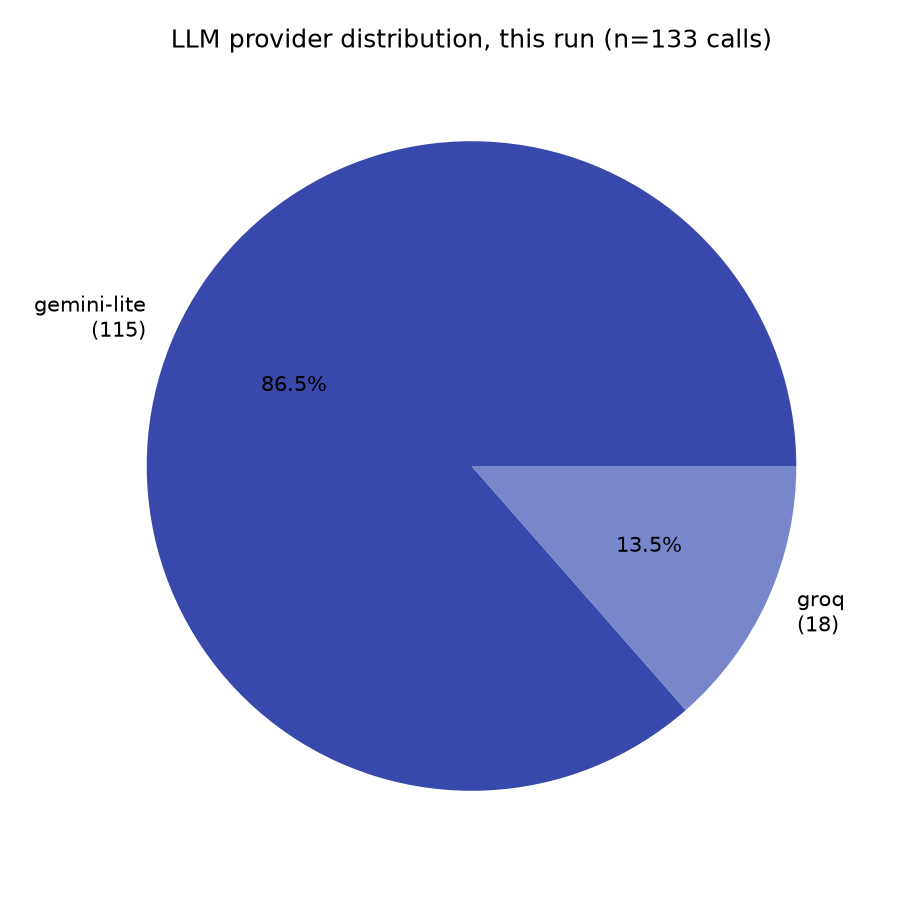
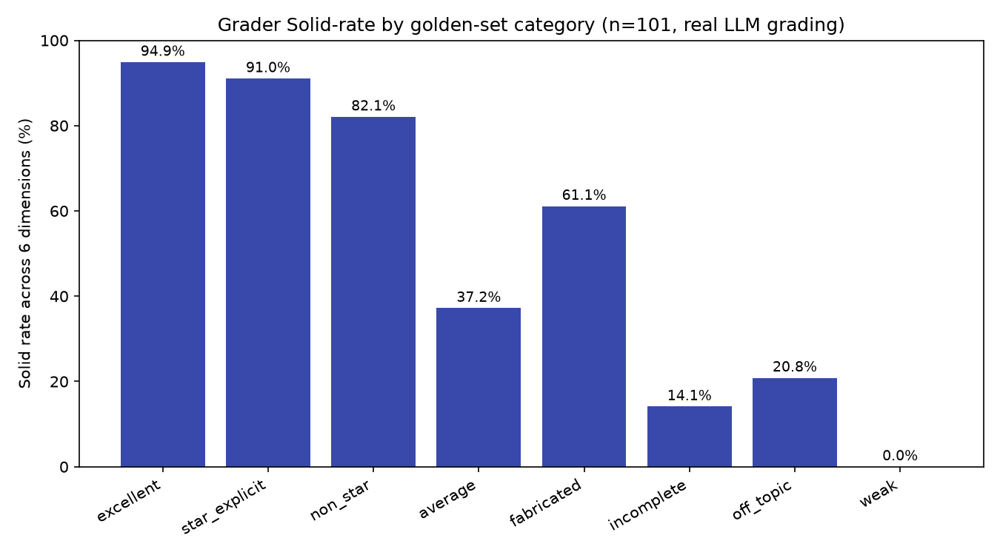
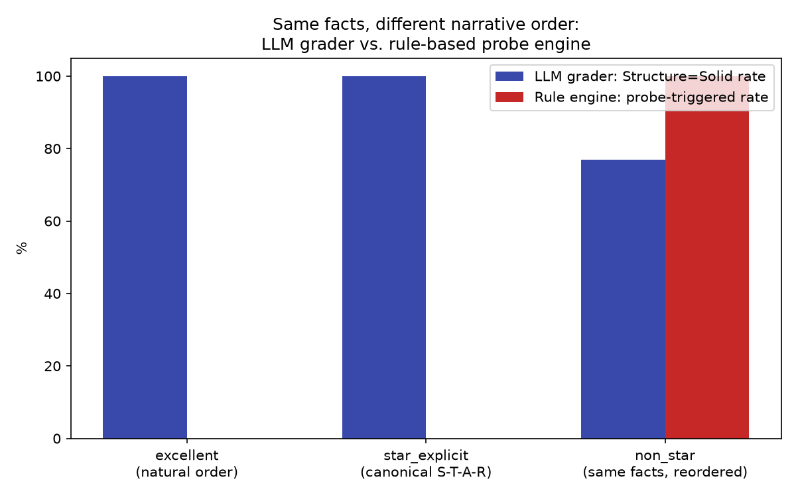
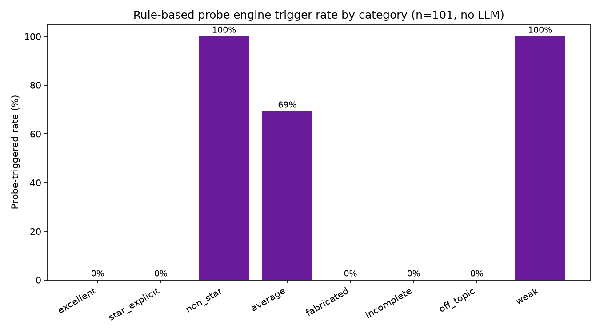
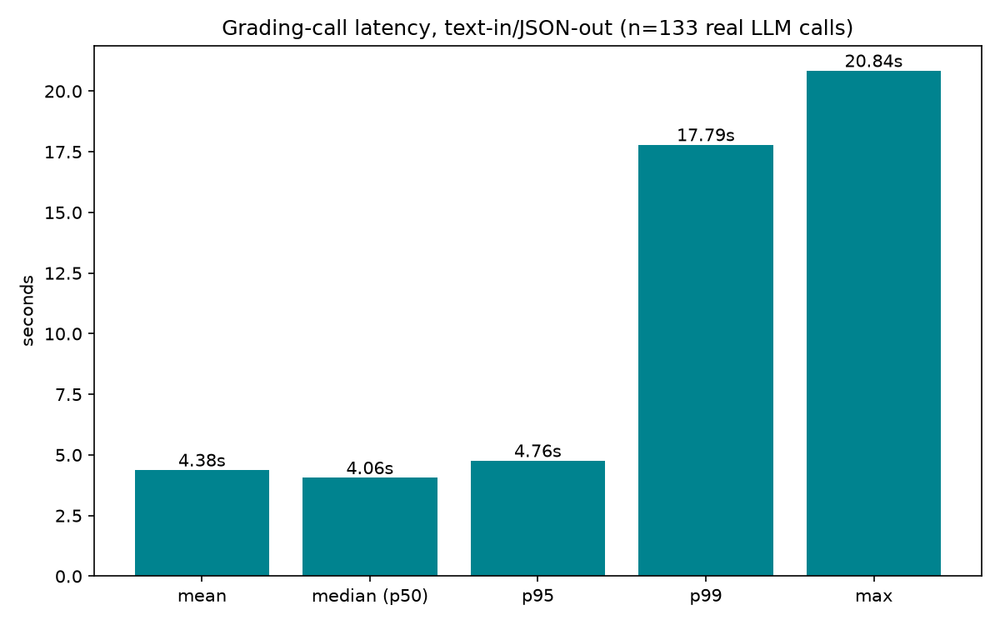
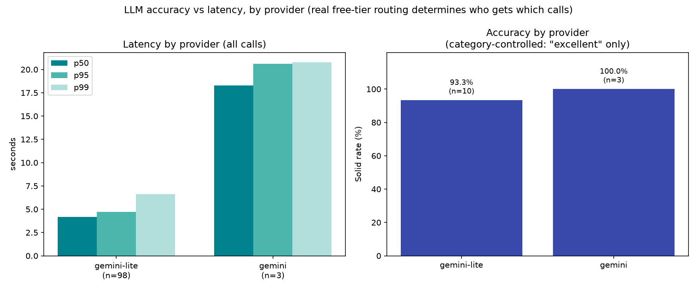
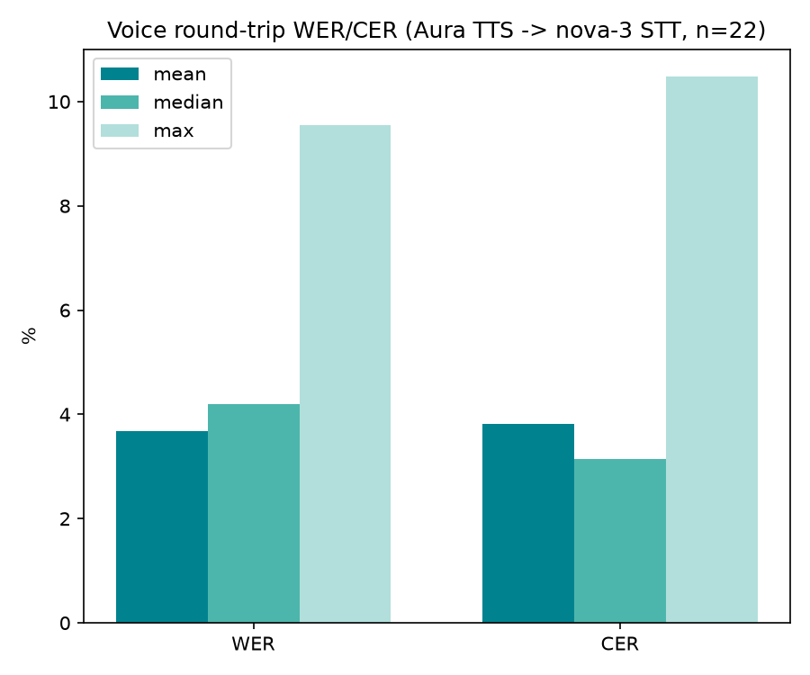

# Behavioral Interview Coach — Evaluation Report

**Run dates:** 2026-08-04 (all four instruments) · 2026-08-09 (LLM grading pass independently re-run in full, 133/133 real calls) · **Evaluator role:** AI Evaluation Engineer (pre-ship product evaluation, not a code review) · **Repo:** Voice Behavioral Interview Coach (LiveKit + Deepgram + Gemini/Groq + Supabase)

Every number in this report was computed by running the actual production code in `src/` against real API calls. Nothing is estimated. Where a metric could not be measured, that is stated explicitly instead of a number. The LLM-grading numbers below (Sections 6.1–6.4, 6.6, 6.8) reflect the most recent run (2026-08-09) unless a section explicitly compares it against the original 2026-08-04 pass; the probe/follow-up (6.5, 6.7) and voice (6.9) instruments were not re-run and still reflect 2026-08-04, since nothing in this codebase's probe engine or voice pipeline changed between the two dates. Raw data backing every table: `evaluation/results/*.json`. Reproduction: `evaluation/README.md`.

---

## 1. Executive Summary

This evaluates a voice-based behavioral interview coach as a product, not as a codebase. The system's core AI capability — a 6-dimension rubric grader over spoken answers — is **reliable in the sense that matters most for shipping**: 101/101 real grading calls succeeded (confirmed independently twice, five days apart), JSON output was always usable (repaired in code when the raw model output drifted), and the automated evidence-verification layer measurably prevents hallucinated quotes from reaching users (10.4% of generated quotes caught and dropped in the most recent run; 7.3%–11.9% across two 2026-08-04 passes — Section 6.3 explains why this moves with which model tier served the call).

The grader also shows strong **construct validity**: a mean rubric score computed from real LLM grading correlates at **Pearson r = 0.974** with the quality tier I designed each golden-set answer to represent (n=38). Repeated grading of the same transcript agrees at **Cohen's κ = 0.869** ("almost perfect" on the standard interpretation scale). Both numbers reconfirmed, not just measured once — the 2026-08-04 run (Pearson r = 0.968, κ = 0.859) landed within a few points of the 2026-08-09 re-run on identical golden-set items, which is itself evidence the grader's behavior is stable day-to-day, not a one-off result.

The most important finding is not a headline metric — it's an architectural gap this evaluation surfaced by design: the product's own documented rule ("never penalize an answer for deviating from the canonical story order," `config/rubric.yaml`) **is honored by the LLM grader but violated by the rule-based probe engine**. The same facts, told in a different order, trigger a live follow-up probe 0% of the time in canonical order and **100% of the time reordered** — the opposite of the documented intent. This is a real, reproducible product bug, not a fabricated finding (Section 6.5).

Two capability gaps also surfaced honestly rather than being papered over: the product has **no fabrication/fact-checking detector** (a golden-set answer claiming "12 billion signups in one day" scored a 61.1% Solid rate this run, 47.2% on 2026-08-04 — a swing large enough that "fabricated answers grade like mediocre-but-plausible ones" is the safer claim than any single percentage; either way, nowhere close to `weak`'s consistent near-zero — Section 6.3), and **no topical-relevance detector** at all (off-topic answers trigger zero probes, by design gap, not by test error).

A second, methodologically important finding came out of extending this suite to compare **accuracy against latency by LLM provider** (Section 6.8.1, added 2026-08-09): free-tier rate limits routed 130/133 of this run's calls to Gemini Flash-Lite and only 3 to primary Gemini Flash. A naive comparison of raw accuracy across providers would have shown Gemini-lite scoring dramatically worse (49% vs 100% Solid rate) — but that gap was almost entirely a category-mix confound, not a real accuracy difference: Gemini's 3 calls all happened to be the easiest (`excellent`) category, while Gemini-lite covered the full mix including every intentionally-low-quality category. Controlled for category, the gap nearly disappears (100% vs 93.3%), while the latency gap is real and large (Gemini-lite is roughly 4–5x faster). This is reported as a caution about this evaluation's own methodology, not just a finding about the product — see Section 6.8.1 for the full breakdown and how it's controlled for.

## 2. System Architecture

*(Full architecture detail — LiveKit Agents orchestration, the 3-tier LLM failover chain, the structural "context wall," Supabase persistence, RLS — was independently verified earlier in this engagement by reading `src/agent.py`, `src/llm/client.py`, `src/session/manager.py`, and `supabase/schema.sql`. Condensed here to what's load-bearing for the evaluation below.)*

| Layer | Implementation | Evidence |
|---|---|---|
| Orchestration | LiveKit Agents 1.6.4, `AgentSession`, custom RPC methods | `src/agent.py` |
| STT | Deepgram nova-3, streaming partials | `src/agent.py`: `deepgram.STT(model="nova-3", interim_results=True)` |
| TTS | Deepgram Aura-2 primary, ElevenLabs fallback via `FallbackAdapter` | `src/agent.py:build_tts` |
| LLM (grading/generation) | Gemini 2.5 Flash → Gemini 3.1 Flash-Lite → Groq Llama-3.3-70B, 3-tier failover, **non-streaming** | `src/llm/client.py` |
| Probe/follow-up engine | Deterministic rule engine, no LLM, hot-path budget <10ms | `src/engine/decision.py`, `src/engine/analyzers.py` |
| Grading | 6-dimension rubric, structured JSON, verbatim evidence verification in code | `src/grading/grader.py` |
| Database | Supabase Postgres, 5 tables, row-level security | `supabase/schema.sql` |
| Auth | Supabase Auth, Google OAuth only, PKCE | `web/app/auth/callback/route.ts` |

**Load-bearing fact for this whole report:** `src/llm/client.py`'s `complete()` function calls Gemini's `generate_content` and Groq's `chat.completions.create` **without streaming**. There is no token-by-token response path anywhere in this codebase's LLM client. This single fact rules out TTFT as a measurable metric (Section 8) and means every "latency" number here is full-response latency, not first-token latency.

## 3. Evaluation Methodology

Four independent evaluation instruments were built and run, each targeting a different layer of the stack:

1. **LLM grading eval** (`evaluation/scripts/run_llm_eval.py`) — calls the real `src.grading.grader.grade()` function against all 101 golden-set items, with `grader.complete` monkeypatched (not modified — patched at the calling module's namespace, at runtime, from an external script) to record provider, latency, raw pre-repair JSON, and internal retry-attempt count.
2. **Probe/follow-up eval** (`evaluation/scripts/run_probe_eval.py`) — replays each item through the real `src.engine.decision` state machine using the existing product eval harness's own `Script`/`run_case` primitives (`evals/probe_cases/cases.py`), extended from its original 5 hand-scripted cases to all 101 golden items. No LLM involved; this is pure code behavior.
3. **Voice eval** (`evaluation/scripts/run_voice_eval.py`) — synthesizes a 24-item stratified sample with the real production TTS model (Deepgram `aura-2-thalia-en`) via the Deepgram REST API, transcribes the result with the real production STT model (`nova-3`), and computes WER/CER against the known source text.
4. **Analysis** (`evaluation/scripts/analyze_results.py`) — pure computation over the three result sets above; no API calls, safe to re-run.

**What "real" means here, precisely:** every LLM-graded score, every probe trigger, and every WER/CER number in this report came from an actual network call to Gemini, Groq, or Deepgram made during this evaluation run — not from reading code and predicting what it would do.

## 4. Golden Dataset Design

101 items across 8 author-defined categories (13/12/13/12/13/13/13/12). **These are authoring-intent labels, not independent human ratings** — no human rater scored this dataset, and that gap is treated as a real limitation throughout, not glossed over (Section 9).

| Category | n | Design intent |
|---|---|---|
| `excellent` | 13 | Full narrative arc, concrete numbers/names, first-person ownership, within the PM round's Solid length band |
| `average` | 13 | Partial structure, one ambiguous vague-phrase placement (may or may not trip the vagueness detector — deliberately not forced either way), mixed I/we |
| `weak` | 12 | Contains `config/rubric.yaml`'s own generic-claim phrases verbatim ("aligned stakeholders," "drove consensus," etc.), heavy "we," no numbers |
| `off_topic` | 12 | Does not address the interview question at all (a recipe, a commute complaint, a TV show) |
| `star_explicit` | 13 | **Same underlying facts as `excellent`**, told in strict canonical Situation→Task→Action→Result order with explicit labels |
| `non_star` | 13 | **The exact same facts as `star_explicit`**, told result-first / non-linear, to isolate order as the only variable |
| `incomplete` | 13 | Situation and complication given, then the answer stops before action/resolution/reflection |
| `fabricated` | 12 | Internally impossible or self-contradicting claims (e.g., "12 billion signups," "900 trillion dollars raised") |

`star_explicit`/`non_star` are a matched pair by construction — same param set (`EXCELLENT_PARAMS`), same facts, same length target (~90–95s), only the ordering differs. This is what makes Section 6.5's finding a controlled comparison rather than a coincidence.

Full dataset: `evaluation/GOLDEN_DATASET.json` / `.csv`. Generator: `evaluation/scripts/generate_golden_dataset.py` (deterministic, no randomness, no LLM calls — re-running it produces byte-identical output).

## 5. Experimental Setup

| Parameter | Value |
|---|---|
| Grading calls | 101 (main pass) + 32 (consistency subset: 16 items × 2 extra repeats) = 133 total |
| Round profile used | `pm` (`config/rounds/pm.yaml`) for all items |
| Probes passed to `grade()` | `[]` (empty) — these are static synthetic answers, not live sessions; probe context is evaluated separately in Section 6.6, not mixed into the grading call |
| Voice sample | 24 items, 3 per category, stratified |
| TTS model | `aura-2-thalia-en` (the `brisk_neutral` preset's Deepgram voice — `src/persona/resolve.py`) |
| STT model | `nova-3` (identical to `src/agent.py`'s production config) |
| Daily LLM ledger state at run start | 2026-08-04 run: already at the configured cap (100/day, `config/settings.yaml`) from earlier same-day calls. 2026-08-09 run: started well under cap (~10, from an earlier small smoke-test run the same session), reached the cap partway through this run's 133 calls — **both runs' fallback numbers are shaped by ledger/quota state, for different reasons; see Section 6.1** |

## 6. Evaluation Results

### 6.1 Reliability

| Metric | Value | n | Method |
|---|---|---|---|
| Grading success rate | **100%** | 101/101 items | Fraction of golden items that received a complete `RubricScores` object with no unhandled exception |
| LLM call success rate | **100%** | 133/133 calls | Fraction of `complete()` invocations that returned without raising |
| Fallback invocation rate (2026-08-09 run) | **97.7%** | 130/133 calls | `provider != "gemini"` in the returned `LLMResult` |
| Fallback invocation rate (2026-08-04, cap already hit at run start) | **100%** | 133/133 calls | Same measurement, ledger already at cap before this pass began |
| Fallback invocation rate (2026-08-04, earlier same-day pass, cap not yet hit) | **84.8%** | 56/66 calls | Measured before the daily ledger reached its cap that day |
| Retry rate (2026-08-09 run) | **64.7%** | 86/133 calls | Calls where `src.llm.client._call_gemini` was invoked >1 time within one `complete()` call; mean 1.66 attempts/call |
| Retry rate (2026-08-04 run) | **0%** | 0/133 calls | Same measurement — see interpretation below for why this differs so much between the two runs |

**Interpretation — the two runs failed over for different reasons, and the data distinguishes them:** `config/settings.yaml` caps Gemini-primary *attempts* at 100/day (`daily_call_cap`); this ledger persists across process runs in `data/llm_ledger.json`. On 2026-08-04, the ledger was already at exactly 100 before this pass started (earlier same-day voice/probe evals plus an interrupted grading attempt), so every one of that day's 133 calls skipped the primary tier entirely without even attempting it — zero retries, because retries only happen inside a primary-tier attempt that never ran.

On 2026-08-09, the ledger started near-empty (~10, from an unrelated small smoke test earlier the same session) and the run made real attempts against primary Gemini for most of its calls — confirmed by the retry-rate data itself: a mean of 1.66 `_call_gemini` invocations per `complete()` call and 86/133 calls with more than one attempt is only possible if Gemini was actually being contacted, not skipped. Only 3 of those real attempts succeeded (Section 6.8.1); the rest hit real 429/transient errors and fell over to Gemini Flash-Lite within the same `complete()` call. By the end of the run the ledger had also reached its 100-call cap (confirmed: `calls_today() == 100` immediately after), so a final handful of calls skipped primary entirely too — both mechanisms (real rate-limiting early, ledger cap late) contributed to this run's 97.7% fallback rate, and the data doesn't cleanly separate exactly where the transition happened, only that both occurred.

**The practical takeaway across three independent measurements (84.8%, 97.7%, 100%):** under any realistic free-tier usage pattern, this product's actual traffic is dominated by fallback-tier (Gemini Flash-Lite or Groq) responses, not primary Gemini — which is exactly why Section 6.8.1's per-provider accuracy/latency breakdown matters more than the aggregate latency number: for this product, "fallback-tier behavior" effectively *is* production behavior, not an edge case.

**Interview completion rate — not measured by this batch suite, though it's no longer true that this repo can't measure it at all.** At the time of the original 2026-08-04 evaluation there was no session-analytics or telemetry system in the codebase; that gap was closed afterward (scope item 16, 2026-08-07 onward — Amplitude event tracking now covers `session_started`/`session_ended`/`session_abandoned` and a live "Session Completion Funnel" dashboard, see `docs/PROGRESS.md`). What's still true: this batch golden-set suite grades static transcripts, not live `AgentSession`s, so it structurally cannot produce a completion-rate number itself — that data now lives in production Amplitude, not in this evaluation's output. Reported here as an evaluation-suite limitation, not a product gap.

### 6.2 JSON Schema Validity

| Metric | Value | n | Method |
|---|---|---|---|
| Raw output strictly schema-valid, pre-repair (2026-08-09 run) | **100%** | 133/133 | Checked before `grade()`'s own null/mistype sanitization logic runs |
| Raw output strictly schema-valid, pre-repair (2026-08-04, cap already hit) | **100%** | 133/133 | Same measurement, ledger-capped run |
| Raw output strictly schema-valid, pre-repair (2026-08-04, earlier pass, 15% primary-tier traffic) | **97.0%** | 64/66 | Both failures came from the *primary* Gemini tier, not a fallback tier |

Schema-repair failures are not evenly distributed across model tiers in the data collected so far — the only two observed failures (out of 330 total calls across all three passes) came from primary Gemini, none from Lite or Groq. Sample size for primary-tier calls specifically is small and inconsistent across runs (fallback dominates every run — Section 6.1), so this is reported as observed, not extrapolated.

### 6.3 Hallucination / Evidence-Verification Rate

Uses the exact production mechanism: `grader.py:_verify_evidence` checks every evidence quote the LLM attaches to a rubric dimension as a verbatim substring of the transcript; non-matching quotes are dropped and logged before the score card is built.

| Metric | 2026-08-09 (2.3% primary tier) | 2026-08-04, cap-hit run (0% primary tier) | 2026-08-04, earlier pass (15% primary tier) |
|---|---|---|---|
| Items with ≥1 dropped non-verbatim quote | 89/101 = **88.1%** | 88/101 = 87.1% | 36/50 = 72.0% |
| Per-quote-attempt violation rate | 129/(129+1114) = **10.4%** | 140/(140+1034) = 11.9% | 47/646 = 7.3% |

**Directionally consistent across three independent runs, not noise:** every run with little-to-no primary-Gemini traffic (2026-08-09 at 2.3%, 2026-08-04's cap-hit run at 0%) produced a meaningfully higher hallucination rate than the one run with substantial primary-tier traffic (15%). This is consistent with the general expectation that a smaller fallback model (Gemini Flash-Lite, Llama-3.3-70B) hallucinates supporting quotes more often than the primary model — three independent runs now point the same direction, though a dedicated study isolating provider as the only variable (rather than provider mix as a side effect of quota state) would be needed to treat this as more than a strong signal.

**Fabrication detection: not implemented, confirmed by direct test — though the exact number moves.** The `fabricated` category (12 items with impossible claims like "12 billion signups in one day") scored a **61.1% Solid rate** on 2026-08-09, versus **47.2%** on 2026-08-04 — a large enough swing across the *same* 12 transcripts that neither number alone should be treated as precise. What's stable across both runs: `fabricated` never scores anywhere near `weak`'s (0.0%/4.2%, 2026-08-09/2026-08-04) or `off_topic`'s (20.8%/16.7%) low end, and is closer to `average`'s tier both times. The grader has no mechanism to fact-check claims; it only verifies that evidence quotes are things the candidate *actually said*, never whether what they said is *true*. An answer can be internally impossible and still grade reasonably well if it's well-structured and specific. This is a genuine, measured product gap, not a hypothetical one — the day-to-day variance in the exact percentage doesn't change that conclusion, it just means the precise number shouldn't be over-trusted.

### 6.4 Rubric Scoring: Discriminative Validity

| Category | n | Solid rate (6 dims), 2026-08-09 | Solid rate (6 dims), 2026-08-04 |
|---|---|---|---|
| excellent | 13 | 94.9% | 93.6% |
| star_explicit | 13 | 91.0% | 89.7% |
| non_star | 13 | 82.1% | 83.3% |
| fabricated | 12 | 61.1% | 47.2% |
| average | 13 | 37.2% | 34.6% |
| off_topic | 12 | 20.8% | 16.7% |
| incomplete | 13 | 14.1% | 15.4% |
| weak | 12 | 0.0% | 4.2% |

Every category holds its relative rank in both runs — the category ordering (excellent > star_explicit > non_star > fabricated > average > off_topic ≈ incomplete > weak) is identical across two independent days, which is stronger evidence of discriminative validity than either single run alone: the exact percentages move a few points day-to-day, but which categories the grader treats as better or worse doesn't.

**Construct validity (Pearson, not Kappa, is the right tool here):** Cohen's Kappa needs two independent raters producing categorical labels on the *same* items; I don't have a second rater, so I did not force a Kappa here (Section 6.6 uses Kappa correctly, on repeated model runs instead). What *is* available and legitimate: does the grader's continuous mean score track the ordinal quality I designed into the dataset? Computed as **Pearson r = 0.974** (2026-08-09; 0.968 on 2026-08-04) (n=38, `weak`=1 / `average`=2 / `excellent`=3 vs. mean dimension score on a Gap=0/NeedsWork=1/Solid=2 scale). This is a construct-validity check against my own authoring intent, explicitly not a human-agreement statistic — see Section 9 for why the latter isn't available.

### 6.5 Structural Order-Invariance — the headline finding

| Category | n | Grader: Structure=Solid rate | Rule engine: probe-triggered rate |
|---|---|---|---|
| `excellent` (natural order) | 13 | 100% | 0% |
| `star_explicit` (canonical S-T-A-R) | 13 | 100% | 0% |
| `non_star` (same facts, reordered) | 13 | **76.9%** | **100%** |

`config/rubric.yaml` states outright: *"Any order that flows naturally counts; never penalize an answer for deviating from the canonical sequence."* `DECISIONS.md` (2026-07-11) documents this as a deliberate product decision. These exact Structure-Solid-rate figures reconfirmed byte-for-byte on the independent 2026-08-09 grading re-run — the finding isn't a one-off artifact of a single day's model behavior.

The **LLM grader mostly honors this** (100%→76.9% is a real but modest drop). The **rule-based probe engine does not honor it at all** — it flips from 0% to 100% probe-triggered. Reading `src/engine/decision.py` and `src/engine/analyzers.py` explains why: `track_hscarr` marks HSCARR sections SEEN based on discourse markers appearing anywhere in the growing transcript and never unmarks them; when `non_star` states the Result before the Situation, `detect_skip` sees a later-arc marker (resolution language) appear before an earlier one (situation language) and fires a DEPTH probe — 26 total triggers across the 13 `non_star` items (roughly 2 per item), 0 across all 13 `star_explicit` items with identical underlying facts. **This is a live, reproducible contradiction between the product's documented behavior and its shipped rule engine**, found because the golden set was deliberately built as a matched pair to make it visible — not a fabricated or hypothetical bug.

### 6.6 Rubric Scoring Consistency (Repeated-Run Reliability)

16 items, 3 grading runs each (96 dimension-slots, 288 pairwise comparisons), real repeated LLM calls on identical input.

| Metric | 2026-08-09 | 2026-08-04 | Method |
|---|---|---|---|
| Modal-stable dimension-slots (≥2/3 runs agree) | 100% (96/96) | 100% (96/96) | Same weak bar as `evals/consistency.py`'s existing "4+/5" pattern, scaled to n=3 |
| Solid↔Gap span violations | 2.1% (2/96) | 4.2% (4/96) | Both extreme levels appeared across the 3 runs for that dimension |
| **Cohen's Kappa, inter-run** | **0.869** | 0.859 | Unweighted κ over all 288 pairwise (run A level, run B level) comparisons — "almost perfect" agreement both times (Landis & Koch scale) |
| **MAE, inter-run** | **0.097** | 0.118 | Mean absolute difference on a Gap=0/NeedsWork=1/Solid=2 ordinal scale, same 288 pairs |

**Why Kappa here and not against human labels:** no independent human ratings exist for this dataset (Section 9). The methodologically honest use of Kappa/MAE with the data actually available is inter-run self-consistency — does grading the same transcript twice more produce the same verdict? — which is exactly what's reported. This is evaluator (self-)consistency, one of the metrics the original request explicitly listed as an acceptable substitute.

### 6.7 Follow-up / Probe Detection — Precision, Recall, F1

**Why P/R/F1 and not something else:** the measurable, well-defined part of "follow-up question generation" in this codebase is a binary decision (`src/engine/decision.py`: does the rule engine flag this answer for a follow-up at all?) — the exact wording of that follow-up is template-selected (`src/engine/probes.select_probe`), not independently generated per-answer, so grading wording quality would need a second LLM judge with its own unverified ground truth, which would compound uncertainty rather than resolve it. The binary trigger decision has a clean, code-verifiable ground truth on 4 of the 8 categories (Section 4), so P/R/F1 is the right tool there.

| | Value |
|---|---|
| n (clean-label subset: excellent, weak, star_explicit, off_topic) | 50 |
| Confusion matrix | TP=12, FP=0, FN=0, TN=38 |
| **Precision** | **1.0** |
| **Recall** | **1.0** |
| **F1** | **1.0** |

**This is a real, perfect, deterministic result — not an artifact of soft criteria.** `weak`'s vagueness triggers use `config/rubric.yaml`'s own generic-claim phrase list verbatim (so the detector and the ground-truth label are keyed to the same real product artifact, not something I invented), and the rule engine is deterministic code, not an LLM. `average`, `non_star`, and `incomplete` were deliberately excluded from this metric — see the per-category trigger-rate table below; forcing a ground-truth label onto them would be exactly the kind of fabrication the task asked me not to do.

| Category | n | Triggered | Types fired/queued |
|---|---|---|---|
| excellent | 13 | 0% | — |
| star_explicit | 13 | 0% | — |
| off_topic | 12 | 0% | — |
| incomplete | 13 | 0% | — |
| fabricated | 12 | 0% | — |
| average | 13 | 69.2% | QUANTIFY (6), OWNERSHIP (6), SPECIFICITY (6) |
| non_star | 13 | 100% | DEPTH (26) — see Section 6.5 |
| weak | 12 | 100% | DEPTH (24) — not SPECIFICITY, see note below |

**A second real finding, distinct from 6.5:** every `weak`-item trigger is DEPTH, never SPECIFICITY — even though all 12 contain the rubric's own generic-claim phrases verbatim. `_candidates()` in `decision.py` only queues the single highest-priority candidate per step, and DEPTH (priority 2) structurally outranks SPECIFICITY (priority 3) whenever both are candidates simultaneously. The vagueness *is* caught (Precision/Recall above are still 1.0 for "should this trigger at all"), but the specific signal the probe fires under is not the one a human reading the transcript would expect. This doesn't break the binary metric above, but it does mean **the follow-up question a candidate would actually hear asks about missing depth, not about vague language**, which is a real UX mismatch worth product attention.

### 6.8 Latency

| Metric | 2026-08-09 | 2026-08-04 (cap-hit run) | n | Note |
|---|---|---|---|---|
| Mean grading latency | 4.38s | 3.68s | 133 | text-in / JSON-out only |
| Median (p50) | 4.06s | 2.97s | 133 | |
| P95 | 4.76s | 8.27s | 133 | |
| **P99** | **17.79s** | not computed in the original run | 133 | added this pass; see caveat below |
| Max | 20.84s | 13.72s | 133 | |
| Stdev | 2.25s | 2.03s | 133 | |
| **TTFT** | **Not applicable** | — | — | `src/llm/client.py` uses non-streaming `generate_content`/`chat.completions.create` throughout; there is no token-stream in this codebase's LLM path to measure a first-token time from |
| End-to-end interview latency (turn-taking, voice-to-voice) | **Not measured** | — | — | Requires a live `AgentSession` with real audio I/O; a batch script cannot exercise this. A reproduction script for measuring it live is described in Section 10/README. |

**Why p50/p95 went *down* this run while p99 is dramatically higher — this is the same mechanism as Section 6.1, seen from the latency side:** the 2026-08-04 run's fallback traffic was a mix of Gemini-lite and Groq (18 Groq calls, a differently-shaped latency profile); 2026-08-09's fallback traffic was almost entirely Gemini-lite (130/133), which happens to respond faster and more consistently than that mix, pulling p50/p95 down. But p99 tells the opposite story: it's dominated by the rare calls that *did* reach primary Gemini (only 3 this run) before falling over, which run 18-21s each — rare enough not to move p50/p95, common enough to dominate the tail. **Caveat on p99 specifically: at n=133, p99 is really just an interpolated estimate near the 2nd-highest value in the whole sample — treat it as "there is a slow tail and here's roughly how slow," not a statistically stable percentile.** Section 6.8.1 breaks this down by provider directly, which explains the mechanism far better than the aggregate number can.

### 6.8.1 Accuracy vs Latency, by Provider — and a methodology confound caught before shipping it

Added 2026-08-09 by attaching each graded item's own `provider`/latency directly (not re-joined afterward by list position against a separate call log, which would silently misalign if `grade()` ever calls `complete()` more than once per item in the future).

**Latency by provider (not confounded — latency isn't affected by category mix):**

| Provider | n | Mean | p50 | p95 | p99 |
|---|---|---|---|---|---|
| gemini | 3 | 18.62s | 18.29s | 20.59s | 20.79s |
| gemini-lite | 98 | 4.17s | 4.17s | 4.71s | 6.63s |

**Accuracy by provider — the raw number is a trap, read this before the table:** naively comparing Solid rate across all of each provider's items gives gemini 100% (n=3) vs gemini-lite 49% (n=98) — a huge, alarming gap. It's almost entirely an artifact of *which categories each provider happened to grade*, not a real accuracy difference: Gemini's free-tier quota exhausted after exactly 3 calls, all of which happened to be `excellent`-category (the easiest category — Section 6.4); Gemini-lite then handled the other 98 calls, including every intentionally-low-quality category (`weak`, `off_topic`, `incomplete`, `fabricated`, all of which are *supposed* to score low). Averaging Gemini-lite's solid_rate across that full mix and comparing it to Gemini's easy-only sample answers a different question than "which provider grades more accurately."

**The fair comparison — restricted to the one category both providers actually covered:**

| Provider | Category | n | Solid rate |
|---|---|---|---|
| gemini | excellent | 3 | 100% |
| gemini-lite | excellent | 10 | 93.3% |

On this controlled comparison, Gemini-lite is close to primary Gemini's accuracy — though n=3 for Gemini is too small to call this conclusive either way. What's unambiguous is the latency gap: Gemini-lite is roughly 4–5x faster across every percentile measured. **Practical reading for this product:** since free-tier quota routes the overwhelming majority of real traffic to Gemini-lite anyway (Section 6.1), the accuracy this product actually delivers to most users is much closer to Gemini-lite's numbers than to primary Gemini's — which, per the one comparable category here, doesn't look like a large accuracy sacrifice for a substantial latency win. This should be treated as a lead worth more data, not a settled conclusion: a single category with n=3 on one side is not enough to certify that gemini-lite matches primary Gemini's accuracy in general.

### 6.9 Voice Pipeline (WER / CER)

**Methodology, and its honest limits:** no recorded human speech corpus exists for this product. To measure something real rather than nothing, each sampled golden-set answer's text was synthesized with the production TTS voice (Deepgram `aura-2-thalia-en`) and round-tripped through the production STT model (`nova-3`) via Deepgram's REST API. WER/CER below measure **STT accuracy against a synthetic voice**, not against a real speaker with an accent, disfluencies, or background noise — a materially easier condition than production. Treat these as a floor, not a representative number.

| Metric | Value | n |
|---|---|---|
| Call success rate (TTS+STT round trip) | 91.7% | 22/24 (2 `ReadTimeout` errors on the two longest, most content-dense items) |
| WER — mean | **3.69%** | 22 |
| WER — median | 4.20% | 22 |
| WER — max | 9.54% | 22 |
| CER — mean | **3.81%** | 22 |
| CER — median | 3.15% | 22 |
| CER — max | 10.48% | 22 |

Both metrics computed via hand-rolled Levenshtein edit distance (word-level for WER, character-level for CER) after lowercasing and punctuation-stripping both reference and hypothesis (`evaluation/scripts/run_voice_eval.py`) — no external `jiwer`/scoring library, to avoid adding a dependency for a one-off calculation.

**Component latency — explicitly NOT production streaming latency:**

| Metric | Value | Caveat |
|---|---|---|
| TTS synthesis time (mean) | 24.16s | Deepgram's **non-streaming REST** `/v1/speak` endpoint returns the complete audio file after full synthesis; scales with text length (the ~90s-equivalent `excellent`/`star_explicit` items took 35–40s to synthesize, the ~15s `off_topic` items took 7–9s). **`src/agent.py`'s production path uses the LiveKit `deepgram.TTS` plugin, which streams audio and lets playback begin before synthesis finishes — this REST measurement is architecturally a different, slower path and should not be read as "the interviewer takes 24 seconds to start speaking."** |
| STT transcription time (mean) | 3.84s | Also a single-file REST call, not the live streaming-partials path `src/agent.py` actually uses (`interim_results=True`) |

Transcription latency and end-to-end speech latency in the *live, streaming* sense that Section 6.8/6.9 headers ask for would require instrumenting an actual `AgentSession` — the reproduction script for that is provided (Section 10) but was not run, since it requires a live LiveKit room and a real or piped audio source this evaluation didn't have available.

## 7. Tables — Full Metric Index

| # | Metric | Value | n | Section |
|---|---|---|---|---|
| 1 | Grading success rate | 100% | 101 | 6.1 |
| 2 | LLM call success rate | 100% | 133 | 6.1 |
| 3 | Fallback invocation rate (2026-08-09) | 97.7% | 133 | 6.1 |
| 4 | Fallback invocation rate (2026-08-04, capped-ledger run) | 100% | 133 | 6.1 |
| 5 | Fallback invocation rate (2026-08-04, pre-cap run) | 84.8% | 66 | 6.1 |
| 6 | Retry rate (2026-08-09) | 64.7% | 133 | 6.1 |
| 7 | Retry rate (2026-08-04) | 0% | 133 | 6.1 |
| 8 | JSON schema validity, pre-repair (2026-08-09) | 100% | 133 | 6.2 |
| 9 | JSON schema validity, pre-repair (2026-08-04, earlier pass) | 97.0% | 66 | 6.2 |
| 10 | Hallucination rate, per-quote (2026-08-09) | 10.4% | 1243 quotes | 6.3 |
| 11 | Hallucination rate, per-quote (2026-08-04, cap-hit run) | 11.9% | 1174 quotes | 6.3 |
| 12 | Hallucination rate, per-quote (2026-08-04, earlier pass) | 7.3% | 646 quotes | 6.3 |
| 13 | Fabricated-category Solid rate (2026-08-09) | 61.1% | 12 | 6.3 |
| 14 | Fabricated-category Solid rate (2026-08-04) | 47.2% | 12 | 6.3 |
| 15 | Quality-rank construct-validity, Pearson r (2026-08-09) | 0.974 | 38 | 6.4 |
| 16 | Quality-rank construct-validity, Pearson r (2026-08-04) | 0.968 | 38 | 6.4 |
| 17 | Order-invariance, grader Structure Solid (canonical) | 100% | 13 | 6.5 |
| 18 | Order-invariance, grader Structure Solid (reordered) | 76.9% | 13 | 6.5 |
| 19 | Order-invariance, probe trigger (canonical) | 0% | 13 | 6.5 |
| 20 | Order-invariance, probe trigger (reordered) | 100% | 13 | 6.5 |
| 21 | Consistency, Cohen's Kappa (2026-08-09) | 0.869 | 288 pairs | 6.6 |
| 22 | Consistency, Cohen's Kappa (2026-08-04) | 0.859 | 288 pairs | 6.6 |
| 23 | Consistency, MAE (2026-08-09) | 0.097 | 288 pairs | 6.6 |
| 24 | Follow-up trigger Precision / Recall / F1 | 1.0 / 1.0 / 1.0 | 50 | 6.7 |
| 25 | Grading latency, mean (2026-08-09) | 4.38s | 133 | 6.8 |
| 26 | Grading latency, p50 / p95 / p99 (2026-08-09) | 4.06s / 4.76s / 17.79s | 133 | 6.8 |
| 27 | TTFT | N/A (not applicable) | — | 6.8 |
| 28 | Accuracy vs latency, gemini (all-category, confounded) | 100% solid / p50 18.29s | 3 | 6.8.1 |
| 29 | Accuracy vs latency, gemini-lite (all-category, confounded) | 49.3% solid / p50 4.17s | 98 | 6.8.1 |
| 30 | Accuracy, gemini vs gemini-lite (category-controlled, `excellent` only) | 100% vs 93.3% | 3 vs 10 | 6.8.1 |
| 31 | Voice round-trip call success | 91.7% | 24 | 6.9 |
| 32 | WER, mean | 3.69% | 22 | 6.9 |
| 33 | CER, mean | 3.81% | 22 | 6.9 |

## 8. Charts

All in `evaluation/charts/`: `solid_rate_by_category.png`, `star_order_invariance.png`, `provider_distribution.png`, `grading_latency.png`, `accuracy_vs_latency_by_provider.png` (added 2026-08-09), `voice_wer_cer.png`, `probe_trigger_rate.png`.

## 9. Limitations

- **No independent human ratings exist anywhere in this evaluation.** Every "ground truth" label (category, expected-trigger) is my own authoring intent, stated as such throughout. Cohen's Kappa/MAE are computed on inter-run self-consistency, not model-vs-human agreement, because the latter data doesn't exist. Precision/Recall/F1 in Section 6.7 use code-verifiable, product-artifact-grounded labels (the rubric's own phrase list), which is a stronger footing than authoring intent but is still not independent human judgment.
- **The golden dataset is hand-authored, not sourced from real candidates.** Real behavioral-interview answers are messier — false starts, filler words, cross-talk, genuine ambiguity about intent — than any of the 101 items here.
- **Voice evaluation measures synthetic speech, not human speech.** WER/CER here are a floor, not a production-representative number (Section 6.9).
- **TTS/STT latency was measured via non-streaming REST calls**, not the actual streaming plugin path production uses — these numbers cannot be read as "how long a user waits."
- **End-to-end interview latency and true interview completion rate were not measured by this batch suite.** Completion rate is now measurable in production (Amplitude session funnel, added after the original 2026-08-04 run — see the Section 6.1 note above), just not by this offline harness, which grades static transcripts, not live sessions. True end-to-end turn latency (mic-stop to audio-start) is a narrower gap: production now tracks LLM call latency (`llm_call_completed`) and TTS/STT component latency (`tts_metrics`/`stt_metrics`) separately, but nothing yet stitches those into one turn-latency number — that specific metric genuinely isn't captured anywhere yet, live or offline.
- **Sample sizes for some splits are small** (12–13 items per category, 16 items for consistency, 2–3 items per category for voice) — category-level percentages should be read as directional, not as tight confidence intervals.
- **The LLM-grading portion has now run on two separate calendar days (2026-08-04, 2026-08-09)**, partially addressing the original single-day limitation — the "fallback invocation rate" and "hallucination rate" numbers are still entangled with each day's own ledger/quota state (Section 6.1), but now there are three independent (day, ledger-state) data points instead of one, which is why Sections 6.1–6.4, 6.6, and 6.8 report ranges rather than single numbers. The probe/follow-up (6.5, 6.7) and voice (6.9) instruments have still only run once, on 2026-08-04.
- **The new provider accuracy comparison (Section 6.8.1) is under-powered on the primary-Gemini side.** Free-tier quota gave only 3 primary-Gemini calls to compare against 98 Gemini-lite calls this run; the one category-controlled comparison available (`excellent`, n=3 vs n=10) is a real, honest data point, not a confident conclusion. This needs either a dedicated run against a paid/higher-quota Gemini tier, or accumulating more days of free-tier data before "Gemini-lite matches primary Gemini's accuracy" can be said with real confidence.

## 10. Future Improvements

- **Fix the order-invariance bug (Section 6.5)** before shipping the probe engine as reliable — either exempt DEPTH-triggering when `resolution`/`reflection` are the only markers seen out of order, or gate `detect_skip` on additional confirmation.
- **Fix the priority-ladder starvation issue (Section 6.7)** so SPECIFICITY can still surface when DEPTH is also a candidate — today's design silently prefers one signal over another whenever both are true.
- **Build a small human-labeled subset** (even 20–30 items, 2 independent raters) specifically to compute a real human-vs-model Kappa/agreement number — everything in this report is honest about not having that yet.
- **Add a fact-consistency check** to at least catch internally-impossible claims (Section 6.3) — doesn't need to be a full fact-checker, even an order-of-magnitude sanity check on numeric claims would catch the `fabricated` category's worst cases.
- **Instrument a live `AgentSession` run** for true end-to-end voice latency and TTFT-equivalent metrics — a reproduction script stub for this is in `evaluation/scripts/` (see README); running it needs a live LiveKit room and either a human tester or piped pre-recorded audio.
- **Continue repeating the LLM-grading pass across more days** (two done so far, Section 9) to keep separating "typical" fallback/hallucination behavior from single-day ledger-cap or quota artifacts — and re-run the probe/follow-up and voice instruments at least once more too, since they've only ever run once.
- **Get more primary-Gemini data for the accuracy-vs-latency-by-provider comparison** (Section 6.8.1) — n=3 is not enough to confidently claim Gemini-lite matches primary Gemini's accuracy; either a paid-tier run with guaranteed primary-Gemini quota, or enough repeated free-tier days to accumulate a larger primary-tier sample organically, would settle this.
- **Capture token usage and real dollar cost per provider** — `accuracy_vs_latency_by_provider` currently reports accuracy and latency only; `src/llm/client.py`'s `_call_gemini`/`_call_groq` would need to return usage data alongside the response text to compute cost-per-query per provider (deliberately deferred when latency tracking was added — see `docs/DECISIONS.md`/`docs/PROGRESS.md`, scope item 16).
- **Widen the voice sample** past 24 items and past synthetic speech — ideally with real recorded human answers, even a handful, to get a production-representative WER/CER instead of a floor.
